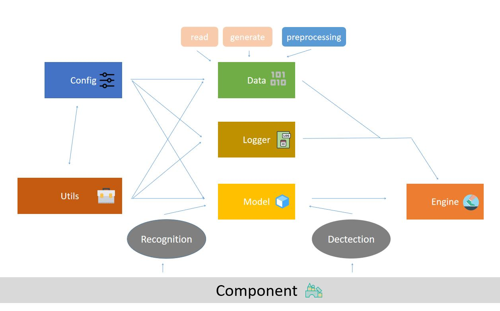

# Fudan OCR


Fudan OCR is a platform for OCR researchers, 
integrating several OCR modules and models. 
Users can train existing models based on this platform, 
or implement their own models using lightweight codes.
With this platform, researchers can implement many OCR works such as 
word detection, word recognition, text super-resolution, etc.

## Introduction for each Module
FudanOCR is divided into several parts. 
The following is a brief introduction to each module. 
For details, see the README file under each directory.

<div align=center></div>

- alphabet: Alphabet module. Users can use it to create an alphabet object.
- config: Config module. Provide configuration file template inside, users fill in new configuration files as needed.
- data: Data module. Contain functions such as obtaining datasets, obtaining data loaders, and data preprocessing, etc.
- engine: Engine module(Important!). Users can use this module to initialize a new training environment. Then define a subclass of Trainer to train.
- logger: Log module. Process some recording operations. 
- model: Model module. There are several detection and recognition of existing models, as well as Fudan's previous OCR technical reports.
- component: Component module. Store some small components for building models.
- utils: Utility module. Store some useful functions.

## Dependence
`pip install -r requirements.txt`

python3.6


## Usage

- 1 Import related packages in `main.py`

```python
# -*- coding:utf-8 -*-
from engine.trainer import Trainer
from engine.env import Env
from data.build import build_dataloader
'''
The following statements can be omitted.Look at /model/modelDict for more details
'''
from model.recognition_model.MORAN_V2.models.moran import newMORAN
```

- 2 Define a subclass of Trainer. Then overload some of the function as needed.
```python
from engine.trainer import Trainer
class XXNET_Trainer(Trainer):
    def __init__(self, modelObject, opt, train_loader, val_loader):
        Trainer.__init__(self, modelObject, opt, train_loader, val_loader)

    def pretreatment(self, data):
        '''You need to overload'''
        pass

    def posttreatment(self, modelResult, pretreatmentData, originData, test=False):
        '''You need to overload'''
        pass

    def finetune(self):
        '''You need to overload if you set opt.FUNCTION.FINETUNE to True'''
        pass
```
- 3 Create a new training environment.
```python
env = Env()
opt = env.getOpt() 
'''Use opt to get parameters from config file
print(opt.BASE.MODEL)
'''
```
- 4 Get a dataloader from the data module.
```python
train_loader, test_loader  = build_dataloader(env.opt)
```

- 5 Train your model. (If you have registered your model in /model/modelDict.py, use `model = env.model` for convenience.)
```python
model = newMORAN
newTrainer = XX_Trainer(modelObject=model, opt=env.opt, train_loader=train_loader, val_loader=test_loader).train()
```

## R & D team
This project was developed by students of Fudan University. The leader is Jingye Chen, and the other members of this team are Xiaocong Wang, Siyu Miao, Huafeng Shi, and Peiyao Zhang.
The supervisors of this team are Bin Li and Xiangyang Xue. 

:smile: We are very grateful to those who helped us in the project. And if you have new ideas or suggestions for this project, welcome to pull requests:)